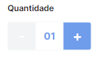
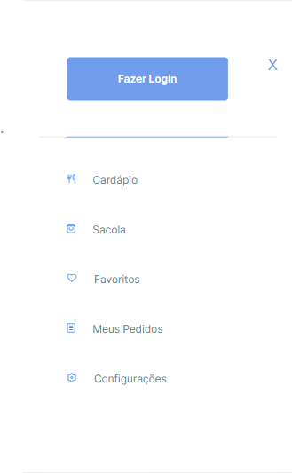
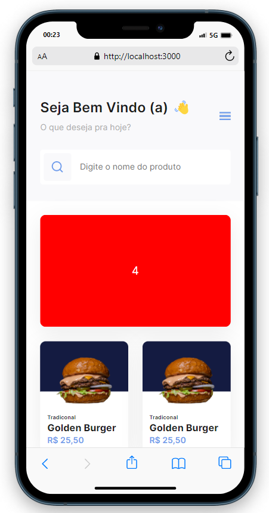
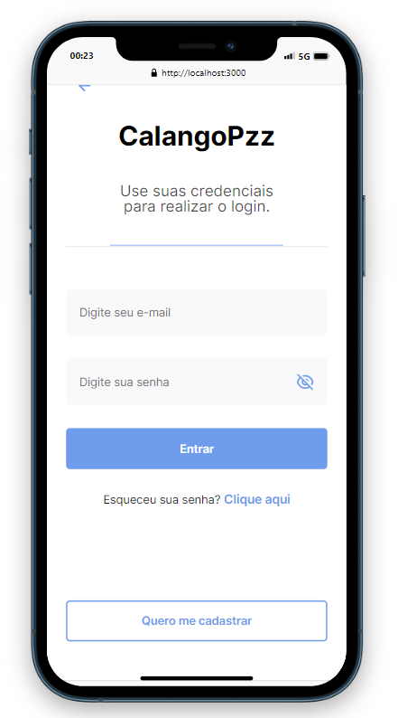
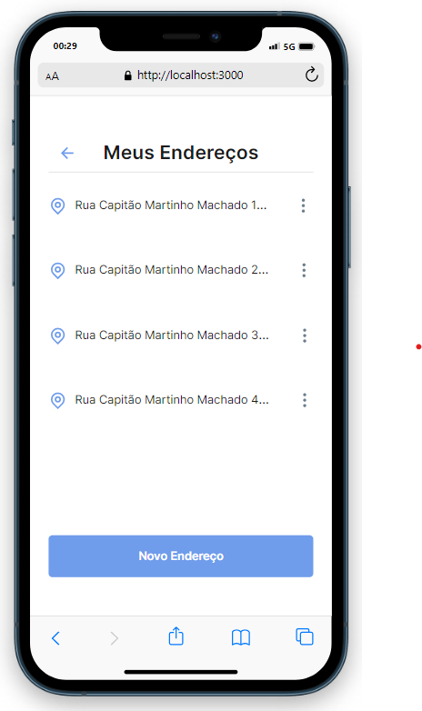
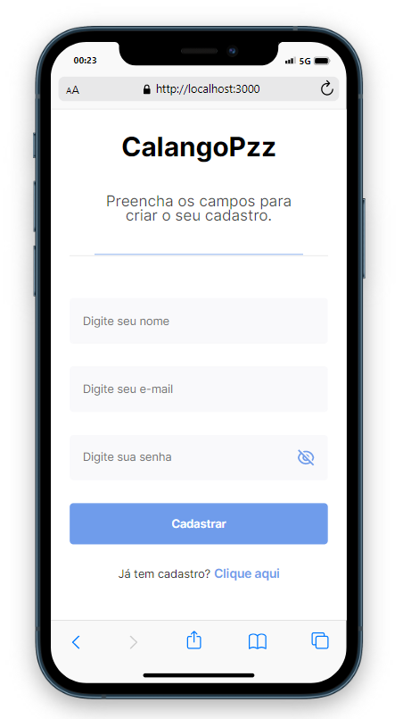
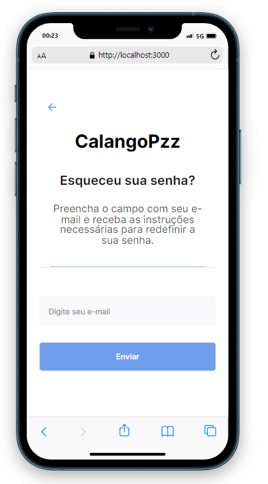
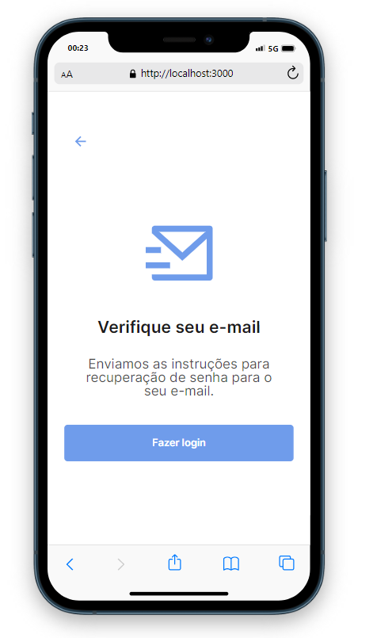
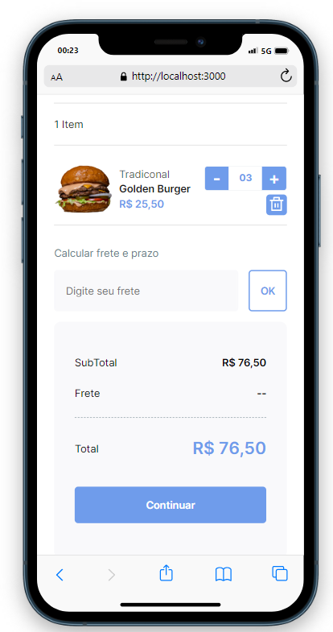
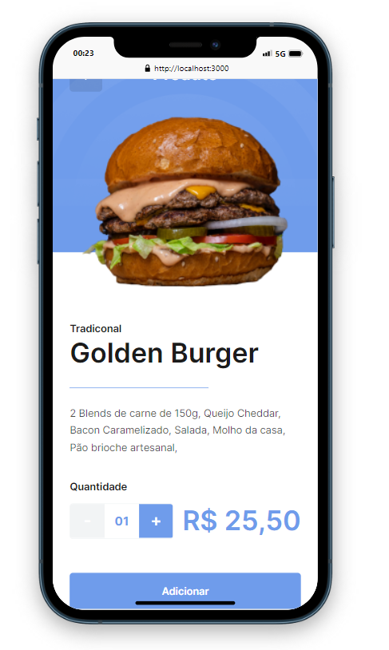

# :pencil2: Projeto Saas (Software as a service / Software como um serviço) B7DELIVERY :computer:

# :clipboard: Pontos importantes do projeto :clipboard: :

## Start Project:

```markdown
npm i

npm run dev
```

Sistema de Delivery

* Pessoas que vão utilizar esse sistema:

- Usuário Final.
- O estabelecimento.
- Admin do sistema.


* Telas:

- Home (Listagem de promoções e produtos)
- Página do produto específico
- Carrinho de compras
- Checkout (para logado)
- Cadastro de endereços
- Login/Cadastro
- Lista de pedidos
- Pedido individual


- Login/Cadastro para estabelecimento
- Listagem de pedidos
- Edição de pedidos
- Listagem de produtos
- Edição de produtos


- Listagem de estabelecimentos
- Edição de estabelecimentos


* Definir as tecnologias:

- NextJS (com SSR)
- Prisma (ORM)
- MySQL / PostgreSQL
- API RESTful
- Typescript

* Análise do layout e divisão de componentes que se repete:

Link do layout: https://www.figma.com/file/6M8Pq62vm6QYPqTsYJBCmf/Ui---B7Delivery?node-id=403%3A14

- Banner.


Elemento que possui um carrossel contendo banners publicitários do cliente.

- Button.


- HeadComponent.
- Header.


O elemento Header contém os elementos da parte superior do site para cada página.

- Input.


Elemento comum em quase todas as páginas e livre para adaptações, respeitando assim o layout pré-estabelecido.

- ProductItem.


O elemento que contém a imagem, preço e categoria dos produtos que o cliente oferece.

- SearchInput.


O elemento que contém o input principal de pesquisa.

- Icon.


O elemento Icon contém um icone que pode ser alterado informações importantes.

- Quantity.



Elemento que desempenha o papel de alterar a quantidade de produto que o usuário deseja.

- SideBar.



Simplesmente o menu lateral.

- SideBarMenuItem.


As opções do menu.

* Páginas:

- Home:



- Login:



- Meus Endereços:



- SignUp:



- Esqueceu Senha:



- Alteração da senha com sucesso:



- Checkout:


- Minicart/Cart:



- PDP/(Página do Produto):



* Alterações no projeto: