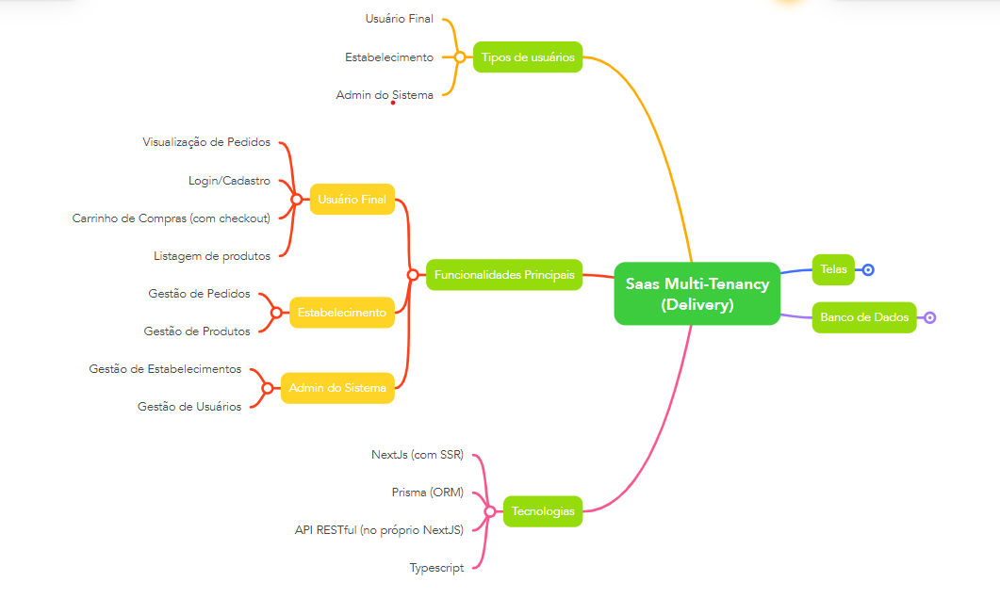
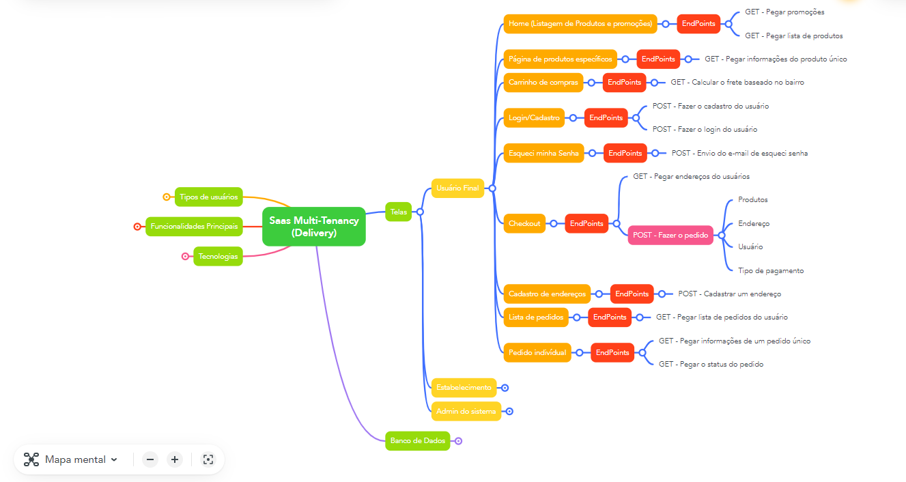
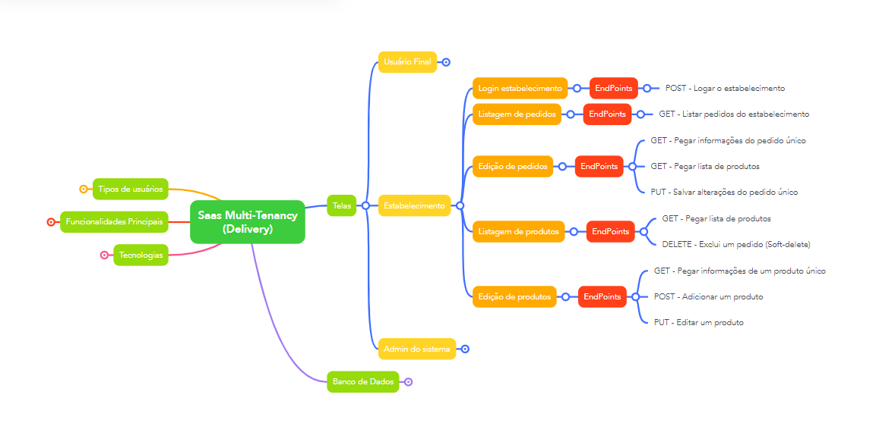
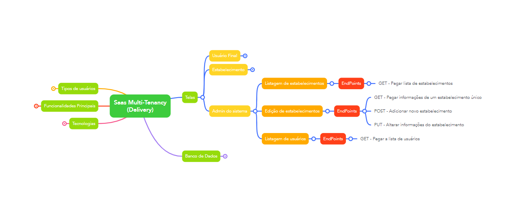
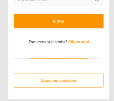
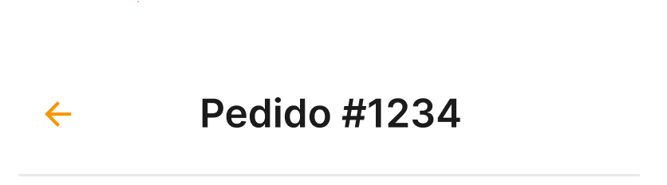
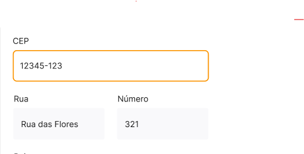
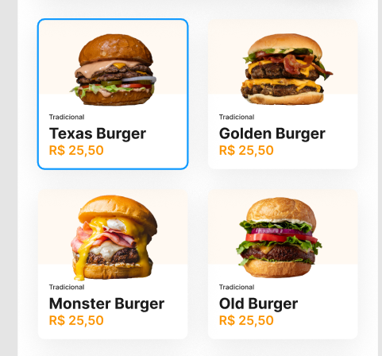
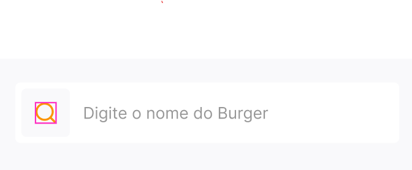

# :pencil2: Projeto Saas (Software as a service / Software como um serviço) B7DELIVERY :computer:

# :clipboard: Pontos importantes do projeto :clipboard: :

Sistema de Delivery

* Pessoas que vão utilizar esse sistema:

- Usuário Final.
- O estabelecimento.
- Admin do sistema.

* Telas:

- Home (Listagem de promoções e produtos)
- Página do produto específico
- Carrinho de compras
- Checkout (para logado)
- Cadastro de endereços
- Login/Cadastro
- Lista de pedidos
- Pedido individual

- Login/Cadastro para estabelecimento
- Listagem de pedidos
- Edição de pedidos
- Listagem de produtos
- Edição de produtos

- Listagem de estabelecimentos
- Edição de estabelecimentos

* Definir as tecnologias:

- NextJS (com SSR)
- Prisma (ORM)
- MySQL / PostgreSQL
- API RESTful
- Typescript

* Análise do layout e divisão de componentes que se repete.

Link do layout: https://www.figma.com/file/6M8Pq62vm6QYPqTsYJBCmf/Ui---B7Delivery?node-id=403%3A14

- Banner

- Button

- HeadComponent
- Header

- Input

- ProductItem

- SearchInput

